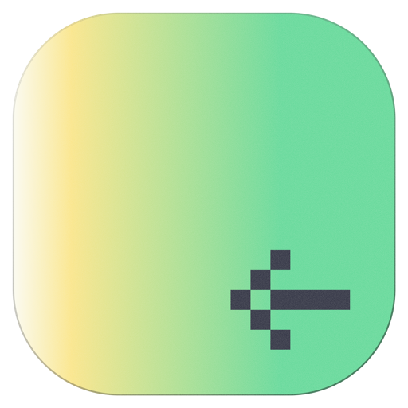
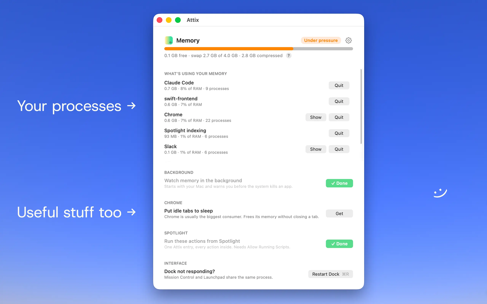

<p align="center">
  
</p>

<h1 align="center">Attix</h1>

On a Mac with 8 GB, running coding agents, a browser and an editor at once,
the kernel starts killing processes to reclaim memory. That mechanism is
Jetsam, and it says nothing: the app that disappears did not crash, it was
terminated.

An attic is what fills up without anyone looking: tabs opened weeks ago, dev
servers whose worktree was deleted, helpers piling up behind an app you think
is idle. Attix is a small AppKit window that shows what is up there and puts
the matching gesture on every line. No account, no permission, no network.

<p align="center">
  
</p>

## Install

### Manual

```sh
git clone <the Attix repo> && cd Attix && ./build.sh
```

Builds `/Applications/Attix.app`; pass a path to build it elsewhere
(`./build.sh ~/Applications`). Needs macOS 14 or later and the Command Line
Tools (`xcode-select --install`). No Xcode, no SwiftPM, no dependencies. The
script compiles the Swift files at the root, builds the icon, copies
`Attix.shortcut` into the bundle, signs ad hoc and re-registers with
LaunchServices. To regenerate the shortcut file: `python3 shortcut.py
Attix.shortcut`.

### With an agent

Copy this into Claude Code, Codex, Cursor or whatever you use, and let it do
the whole thing:

```text
Install Attix on my Mac. It is a small macOS app that watches memory: no
dependencies, no account, and it asks for no macOS permission, so nothing should
prompt me.

1. Clone the Attix repo into a folder I keep (not /tmp). Ask me for the URL and the
   folder if you are unsure.
2. Run ./build.sh in it. It needs macOS 14+ and the Command Line Tools: if swiftc is
   missing, tell me to run xcode-select --install rather than working around it.
3. Open the app and turn on "Open at login" in the card at the bottom of the window.
   Attix is only useful if it is already running when memory runs out.
4. Click "Install" on the Spotlight card: one Attix entry, six actions inside.
5. Then, before I try it, tell me that Shortcuts > Settings (⌘,) > Advanced > Allow
   Running Scripts has to be ticked. It is off by default, all six actions are shell
   commands, and without it the shortcut installs, shows up in Spotlight, and fails
   only at the moment I use it.
6. Finish in three lines: where the app was built, whether it starts at login,
   and the six actions the Spotlight entry now offers.

If a step fails, show me the exact error instead of working around it.
```

## Use

### The window

Three zones, and only the middle one scrolls: the memory bar stays at the top
and the cards at the bottom, so the gesture you opened the app for is never
below the fold. With the menu bar icon on, closing the window does not quit
Attix — it keeps watching, which is the point of the alert; with the icon off,
closing quits, since nothing would be left to reopen it from.

- The bar carries the kernel's own state (Healthy, Under pressure, Critical)
  over three figures: free, swap, compressed, each explained under the `?`.
  Swap is what makes a machine feel stuck: memory moved out to disk.
- **What's using your memory** groups processes under the name you recognize
  on screen: `claude`, `claude.exe` and `node` are one line, not three, and
  twenty Chrome helpers at 40 MB are one line at 2.8 GB. Each shows its size,
  its share of RAM and its process count, with `Show` and `Quit`. Under 60 MB
  is left out.
- **Stale dev servers** lists `node`, `bun`, `deno` and `esbuild` processes
  whose working directory no longer exists on disk: a deleted worktree whose
  server survived it. Each gets its resident size and a `Stop` button. Figures
  refresh every 5 seconds, this scan every 30 since it calls `lsof`.

### The menu bar icon

One icon, nothing else: no figures beside it, no emoji, a fixed-width slot that
never pushes its neighbours around. It is a template symbol, so it takes the
colour of the menu bar itself — black on a light bar, white on a dark one, like
every other icon up there. It never changes shape and never carries a colour of
its own, not even under memory pressure: the alert already has its own panel,
which names the consumer and carries the gesture. The figures are one click
away, in the menu and in the tooltip.

Its menu is not just a way back in: it carries the same gestures as the window.
The state and the three figures on top, then the three largest consumers, each
with its own `Show` and `Quit` — `Quit` goes through the very same confirmation
as in the window, never a silent one. Below: Open Attix, Restart Dock,
Settings…, Quit Attix.

Turn it off in Settings (⌘,). With the icon on, closing the window leaves Attix
watching; with both it and the Dock icon hidden, the way back is Spotlight.

### From Spotlight

One entry named "Attix", six actions inside: Restart Dock, Restart Finder,
Restart Menu Bar, Quit Chrome, Stop Stale Dev Servers, Open Attix. The card in
the window installs it in one click, from the copy shipped in the app bundle.
It needs Allow Running Scripts (see Known limits), and says so beforehand.

### Memory alerts

Attix reads `kern.memorystatus_vm_pressure_level`, the value Jetsam itself
uses to decide what to kill, rather than a threshold of its own. At warning or
critical it draws its own panel, with the app icon, naming the largest
consumer not carrying live work: quitting Chrome costs tabs that come back,
quitting cmux costs a session. It repeats only if things get worse, otherwise
once every 15 minutes.

It also reads the most recent Jetsam report in
`/Library/Logs/DiagnosticReports`, the only proof that an app was killed
rather than crashed. `per-process-limit` (its own limit, machine fine) is
reported calmly, apart from the machine-wide reasons (`vm-pageshortage`,
`highwater`).

### ⌘R

Restarts the Dock, from the window or from the app menu, whenever Attix is
frontmost. Mission Control and Launchpad share that process; if it is not
running, Attix opens it. Either way it checks 1.2 s later that the Dock came
back before claiming success.

## Guardrails

This code sends signals to processes, so the limits are written down:

- **`INTOUCHABLES`** are never listed at all: `WindowServer`, `loginwindow`,
  `launchd`, `kernel_task`, `logind`, `UserEventAgent`. Stopping them costs the
  session, not unsaved work, and a line on which no gesture is safe does not
  belong in a list of gestures.
- **`PROTEGES`** keep their `Quit` button: cmux, Claude Code, Node, terminals,
  VS Code, Xcode, Cursor, Finder. They gain a named warning ("This ends all
  running Claude Code sessions, including this one.") and a dialog whose default
  button is Cancel. Refusing outright would be the dead end of a greyed-out "in
  use". Chrome is not listed: it restores its own tabs.
- **`terminate()`, not `kill`**: a running application gets
  `NSRunningApplication.terminate()`, the same thing as its own Quit menu item,
  so it can prompt and save. `SIGTERM` goes only to bare pids, `SIGKILL` never.
- **Nothing happens on its own**: no threshold that acts, only what you click.
- **A stale server is proven, not guessed**: its working directory, read with
  `lsof -a -d cwd`, no longer exists on disk. No heuristic on name or port.

## Known limits

**The app is signed ad hoc, not notarized.** On your own machine the build is
fine; anyone who receives the `.app` gets blocked by Gatekeeper. Either `xattr
-d com.apple.quarantine /Applications/Attix.app`, or right-click it, choose
Open, and confirm.

**System notifications are impossible without an Apple Developer
certificate.** Measured on 14/09/2026, on a minimal bundle with a stable
identifier, signed ad hoc, launched by LaunchServices:

```
UNErrorDomain Code=1 "Notifications are not allowed for this application"
```

The refusal lands *before* the authorization prompt, so there is nothing to
grant. The `osascript` fallback does show a real banner, but under the Script
Editor icon and with no click action. Hence a panel the app draws itself: it
carries the app's own icon and responds to a click. Properly signed, that
class is ten lines of `UNUserNotificationCenter`.

**App Intents (native Spotlight actions) are out of reach for the same
reason.** The hand-written metadata was structurally identical to Apple's own
Notes app and was never indexed; the only third-party apps exposing App
Intents here are signed with a real certificate. Hence a `.shortcut` file
instead, and that code path was removed in commit `788fffb`.

**The Spotlight shortcut needs "Allow Running Scripts".** Shortcuts > Settings
(⌘,) > Advanced > Allow Running Scripts, unchecked by default. All six actions
are shell commands. Without that box ticked the shortcut installs, appears in
Spotlight, and fails at the moment you use it, with a message about "security
settings" naming neither the setting nor where it is.

**Signing the `.shortcut` file goes through an Apple service that is not
always up.** `shortcuts sign --mode anyone` returned 500 on 14/09/2026 and
worked the next day. `shortcut.py` tries `anyone` first and falls back to
`people-who-know-me`, which signs locally: enough for your own use, not for
handing the file to someone else.

## Tests

```sh
./test.sh
```

42 cases on the pure functions, exit 0 when they all pass. No Xcode and no
SwiftPM here, so XCTest is out of reach: `test.sh` compiles a standalone
executable with `swiftc` from `Mesures.swift` plus `Tests/`, a subfolder
because `build.sh` compiles `*.swift` from the root and a test file at the root
would ship in the app. Covered: the splitting of `ps` output
(`Sonde.analyse`), bundle-name extraction (`Sonde.nomApp`), reverse-DNS names
(`Sonde.joli`), Jetsam `.ips` parsing (`Jetsam.victime`), byte formatting
(`go`), and `ALIAS` grouping.

The `ps` cases earn their keep. An earlier version dropped 566 of 575 lines
and showed Chrome at 205 MB instead of 1273, because `ps` right-aligns its
columns and the leading spaces were eating a split. They pin down leading
spaces, wide and narrow RSS values, paths with spaces, blank and malformed
lines. A tool that measures memory cannot lose half of it in silence.

## Privacy

Attix talks to no network at all: no URL fetch, no update check, no telemetry.
The code contains no `URLSession` and opens no socket. It runs `ps`, `pgrep`,
`lsof`, `killall`, `open`, `shortcuts` and `osascript`, all local, plus two
sysctls and the Jetsam reports.

## Fork it

MIT, see `LICENSE`. Interface in English, code comments in French.

```
Mesures.swift    ps, sysctls, Jetsam reports, stale servers, the guardrail lists
Vues.swift       the AppKit pieces: cards, bar, buttons, scroller
Alertes.swift    the toast and the alert panel the app draws itself
Reglages.swift   login item, Dock-less mode, Spotlight shortcut install
main.swift       the window, the gestures, the menu, the bootstrap
Tests/           the standalone test binary
```

`chrome-extension/` holds the source of [Attix for Chrome](https://chromewebstore.google.com/detail/lfdolekbcojjlhdjndmoohifmpgecopn),
an MV3 extension on the Web Store. It counts open tabs and puts the idle ones
to sleep with `chrome.tabs.discard()`. The tab keeps its title and position and
reloads on click, nothing is closed.
Candidates are tabs not active, not audible, not pinned, not already
discarded, and idle for 20 minutes or more. It shows no per-tab memory:
`chrome.processes` is restricted to internal builds.
